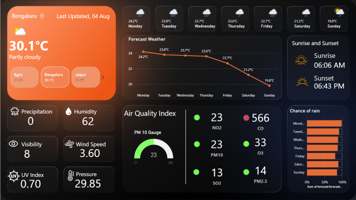

# 🌤️ Weather Analytics Dashboard

A comprehensive Power BI dashboard that visualizes weather data from WeatherAPI.com, providing detailed insights into weather conditions, forecasts, and air quality metrics across major Indian cities.

## 📊 Dashboard Overview

### 🎯 Key Features

- 🌡️ **Current Temperature & Conditions** - Real-time weather data with location updates
- 📅 **7-Day Forecast** - Extended weather predictions with temperature trends
- 🌅 **Sunrise & Sunset Times** - Daily solar schedule tracking
- 💧 **Humidity & Precipitation** - Moisture and rainfall analytics
- 🌪️ **Wind Speed & Direction** - Wind pattern analysis
- 🏭 **Air Quality Index** - Environmental monitoring (PM2.5, PM10, CO, NO2, SO2, O3)
- 👁️ **Visibility & Pressure** - Atmospheric condition tracking
- ☀️ **UV Index** - Solar radiation metrics

## 🏙️ Cities Covered

📍 Bengaluru • Delhi • Mumbai • Chennai • Agra

## 📈 Dashboard Sections

- 🌡️ **Main Weather Panel** - Current temperature with weather conditions and location-specific updates
- 📊 **7-Day Forecast** - Interactive temperature trend line chart with daily weather icons and predictions
- 🌬️ **Air Quality Monitoring** - Real-time AQI gauge with color-coded status and individual pollutant tracking
- ☔ **Weather Metrics** - Precipitation, humidity, wind speed, atmospheric pressure, UV index and visibility
- 📅 **Weekly Rain Forecast** - Day-wise precipitation probability with color-coded rain chance indicators

## 🛠️ Technologies Used

- **Power BI Desktop** - Data visualization and dashboard creation
- **WeatherAPI.com** - Weather data source
- **DAX** - Custom measures and calculations
- **Power Query** - Data transformation
- **Custom Themes** - Professional dark mode design

## 🔄 Data Source

- **WeatherAPI.com Integration** - Connected to reliable weather data source
- **Multi-city Data** - Comprehensive weather information across Indian cities
- **Comprehensive Metrics** - Temperature, humidity, air quality, and forecast data

## 💡 Key Insights Delivered

- 🎯 **Real-time Monitoring** - Stay updated with current weather conditions
- 📊 **Trend Analysis** - Understand weather patterns and forecasts
- 🏭 **Air Quality Awareness** - Monitor environmental health metrics
- 🌍 **Multi-city Comparison** - Compare weather across different Indian cities
- ⚡ **Quick Decision Making** - Visual data for weather-dependent planning
